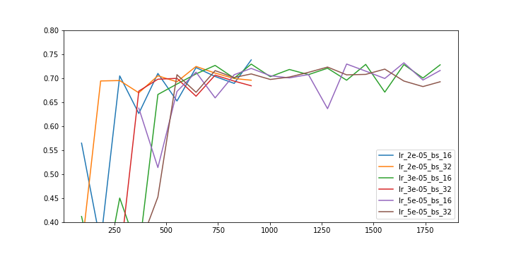

# Stance detection and domain adaptation

Goal: given the Twitter stance detection dataset SemEval 2016 Task 6, train a model to detect stance; then use the same model to detect stance on a new domain (news articles).

## Literature review

The solutions proposed by ([Mohammad 2016](https://www.aclweb.org/anthology/S/S16/S16-1003.pdf)) have surprisingly poor performance, usually not even outperforming the SVM baseline. There has been some work since then that has advanced the SotA for this task. ([Dey et al. 2017](http://sentic.net/sentire2017dey.pdf)) propose a solution with a very simple algorithm but heavy feature engineering process which has the highest reported F1 scores (~74%), ~5% more than previous SotA, on both task A and B of the challenge. Approaches based on deep learning tend to underperform even the SVM baseline reported by the authors of the challenge, though some attention-based deep learning models perform at a similar level, or marginally better, at ~70%  ([Zhou et al 2017](https://warwick.ac.uk/fac/sci/dcs/people/research/csrnaj/WISE2017.pdf)). A more sophisticated approach uses a dynamic memory-augmented network (DMAN) to capture stance-indicative information for multiple related targets, and does multi-task prediction from this dynamic memory ([Wei et al 2018](https://dl.acm.org/citation.cfm?id=3210145)).

The good performance of a model that relies heavily on feature engineering could be explained by the small dataset size for this problem. Approaches using memory-augmented networks could prove useful for a wide range of NLP tasks including stance detection, but are outside the scope of this work. We focus on attention-based deep learning models, which are at least competitive with the SVM baseline ([Zhou et al 2017](https://warwick.ac.uk/fac/sci/dcs/people/research/csrnaj/WISE2017.pdf)) and are likely to continue improving in performance as the dataset size increases. Neural networks are also appealing due to their amenability to multi-task and transfer learning, which is quite relevant for our purposes.

## Choice of model

Absent in literature are approaches that use pre-trained NLP models that could be fine-tuned for a specific purpose, such as ULMFit and BERT, and contextual word embeddings such as ELMo. BERT is a promising approach since its attention mechanism is bidirectional, and it has most recently improved on SotA results in many NLP tasks. While this might not be too much of use in short tweets, it is likely a better encoder for lengthy news articles than e.g. bidirectional LSTMs.

## Experiments

We used the `uncased_L-12_H-768_A-12` BERT model with the 2-sentence set-up: the first sentence being the contents of the tweet, and the second sentence being the target (e.g. "Hillary Clinton").

Grid search over two parameters was performed (with values suggested by BERT's authors: learning_rate in [5e-5, 3e-5, 2e-5], batch_size in [16, 32]) for 20 epochs per set of hyperparameters. The model was evaluated after every epoch (91 steps) on the test set provided by the SemEval competition. Note that in a real-world scenario, the final test set would be used at the very end and hyperparameters would be tuned via k-fold cross validation on the original train set.

The figure below shows the macro average F1 score of a subset of the experiments. The highest achieved score was 73.9% (learning rate = 2e-05, batch size = 16), however the model with the most desirable learning curve (slower convergence, stable and high overall F1) converged at around 72%, with the highest score 72.9% (learning rate = 3e-05, batch size = 16); a later run with this set of hyperparameters achieved 73.7% macro average F1 score, which is competitive with SotA of around 74%. All models converged between the steps 750 and 1250 (respectively 8 and 13.5 epochs).



## Part 2: Domain adaptation

To test how the model trained on Twitter data works on stance.csv, a sample of 40 articles was taken (10 samples per target) and labelled. As would be expected the resulting test set was not balanced. The model trained on the SemEval dataset was used to predict for stance.csv: the title of the article was considered the representation of the article, and the values of `controversial trending issue` were mapped to the equivalent targets used in training (e.g. `hillary` was mapped to `Hillary Clinton`).

The results from evaluating on our 40-article sample are poor:

```
AGAINST_F1 = 0.43243244
AGAINST_precision = 0.30769232
AGAINST_recall = 0.72727275
FAVOR_F1 = 0.5555556
FAVOR_precision = 0.71428573
FAVOR_recall = 0.45454547
NONE_F1 = 0.0
NONE_precision = 0.0
NONE_recall = 0.0
accuracy = 0.45
macro_avg = 0.493994
```

Possible reasons for poor performance

* Vocabulary mismatch. The obvious problem with Twitter data is the usage of special / abbreviated vocabulary, hashtags, username handles, and incorrect spelling in general. This will cause a lot of out of vocabulary (OOV) words when using pretrained models, and will not generalise to a new domain, since it would not contain the same set of hashtags or users. It would be a good idea to replace abbreviations, slang and misspellings in tweets with a more standard vocabulary that is used across other domains (news, books, Wikipedia). This would lead to a bigger overlap between the vocabularies of the source domain (Tweets), target domain (news articles), and pretraining domain (Wikipedia). The contents of hastags (e.g. character-by-character) could also be useful for predicting stance, however it is not clear how might be transferred to a new domain. Using the raw text could be valid in some cases but misleading in others (e.g. a tweet critical of Hillary Clinton could still be tagged with #HillaryForPresident).
* The model's predictions are imbalanced. This is hinted by the high recall of AGAINST and good precision of FAVOR, and is apparent when looking at raw predictions. Training data was also imbalanced, so it might be worth weighting the loss such that data points from under-represented classes receive a higher gradient.
* hashtags. Removing the hashtag degrades performance on the SemEval test set. The fact that there is no equivalent of hastags in news articles might result in a lower performance on this new domain, as the extra tokens created for hastags* in the first SemEval task would never be present in the news prediction task. * This is assuming BERT assigns OOV tokens to a small set of tokens using hashing - need to check if it actually does.
* More work is needed on examining failure modes. It would be interesting to see attention maps from the BERT model to see which tokens the model attends to the most when making a prediction.

## Transfer learning procedure

The current system uses just the stance labels to train the model. There are other features in the source and target domains that could help improve the model accuracy. When optimising for for Part 1, the model could predict not only the stance label but also sentiment of the Tweet. This multi-objective optimisation could give a small amount of boost to the model's performance. Alternatively, the sentiment label could be given as an additional input to the model. That could improve accuracy on Part 1, but we do not have sentiment labels for Part 2 and would therefore need to predict these using a separate model.

In Part 2 there is a feature that could potentially be very valuable - the URL. It is very likely that extracting just the domain name and using it as an input feature could provide a boost to the model's performance, since many websites tend to fairly consistent express views regarding the same topics. In a supervised learning setting one might consider the domain name as a categorical input (represented as an embedding whose value is initialised to an embedding extracted by a char-RNN). In our domain adaptation scenario it could be used as an additional training target: the stances.csv dataset could be used in model fine-tuning such that the URL domain name is predicted based on either the title or the description. This would help the model learn representations for words / phrases / documents that help distinguish between domain names that produced such articles. Such word / phrase representations will be more useful for predicting stance than a vanilla pretrained model, or a model trained solely on Twitter data for stance detection.

Therefore I propose a training procedure that alternates between

* Optimising for sentiment & stance prediction (using a multi-objective model), predicted from tweet / target pair.
* Optimising for URL domain prediction, predicted from the title of the article.
* Optimising for URL domain prediction, predicted from the description of the article.

This way the representations learned by the model are not too Twitter-specific and the model is more likely to do well on stance detection from news articles.

## Discussion

### Limitations of current models for stance detection

While current naive models can enjoy some success, I believe human-level stance detection is not feasible without either (1) a massive labelled dataset that contains the many ways in which a stance can be  expressed towards a given topic or (2) more sophisticated models that don't simply predict the stance of a text towards a specific target, but instead extract the different topics and entities within a sentence and predicts different stances towards these. The work of (Wei et al 2018) seems like a step in the right direction. Simple models may be able to detect the most blatant (and perhaps common) form of biased text, but there are much subtler ways of persuading the audience, such as selectively presenting facts, or making analogies that subconsciously influence the reader's opinion.

### Appropriateness of Twitter => News Articles domain adaptation

Given that the Twitter dataset is not a very big one, it would be probably more practical to focus one's efforts on not domain adaptation between very dissimilar domains, but on labelling the stance.csv dataset in an effective, e.g. using active learning, mass-labelling of content, etc.

## How to run

* Download pretrained BERT model `uncased_L-12_H-768_A-12` to `data/uncased_L-12_H-768_A-12`.
* Download the provided `stance_detection` folder to `data/stance_detection`.
* `python prepare.py` - creates `data/stance_predict.csv` and `data/stance_test_random.csv`. The latter was manually labelled (see my version at `./stance_test_random.csv`).
* `bin/run.sh te` - runs train_and_evaluate for 15 epochs with the best hyperparameters.
* `bin/run.sh eval` - evaluates on `data/stance_detection/SemEval2016-Task6-subtaskA-testdata-gold.txt`
* `bin/articles.sh eval seme/model.ckpt-$STEP` - evaluates the model checkpoint `$STEP` on `data/stance_detection/stance_test_random.csv`
* `bin/articles.sh predict seme/model.ckpt-$STEP` - predicts using model checkpoint `$STEP` on `data/stance_detection/stance_predict.csv` and writes predicted stance labels to `article_preds/test_results.tsv`.
